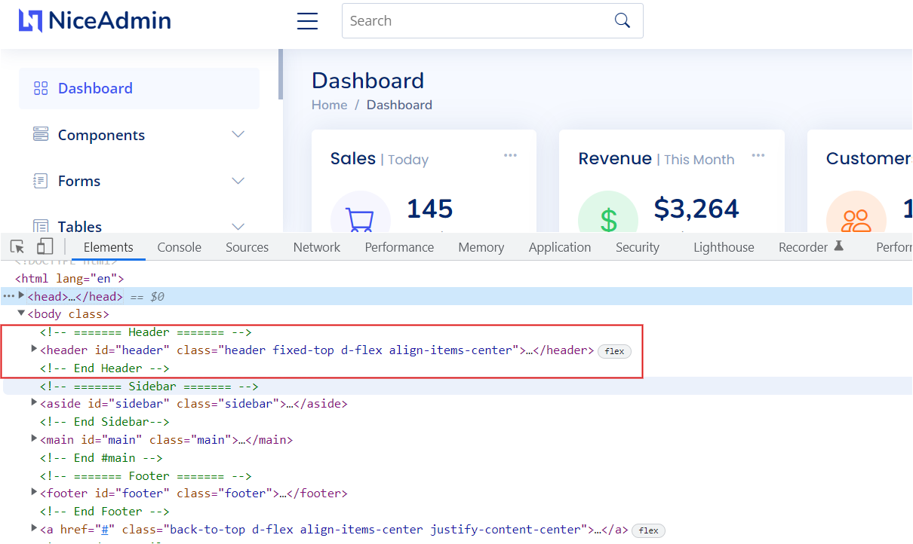
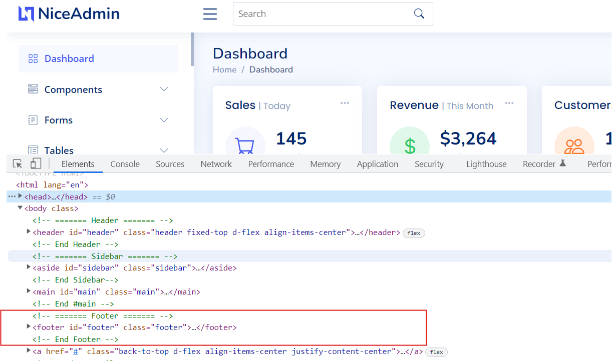
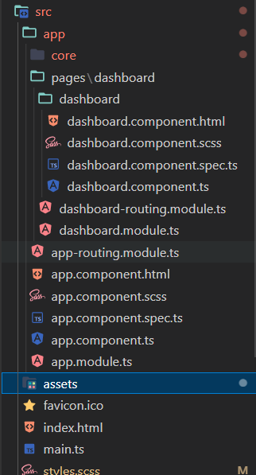
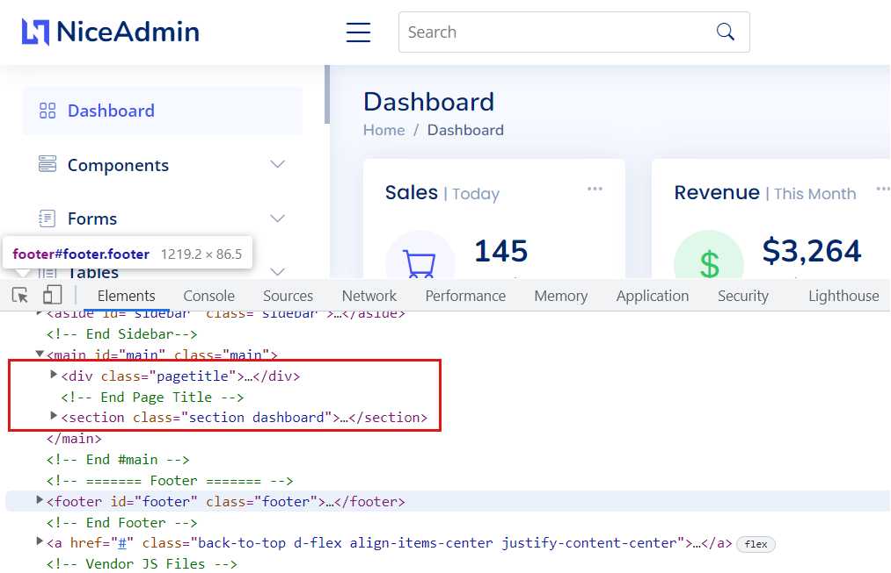
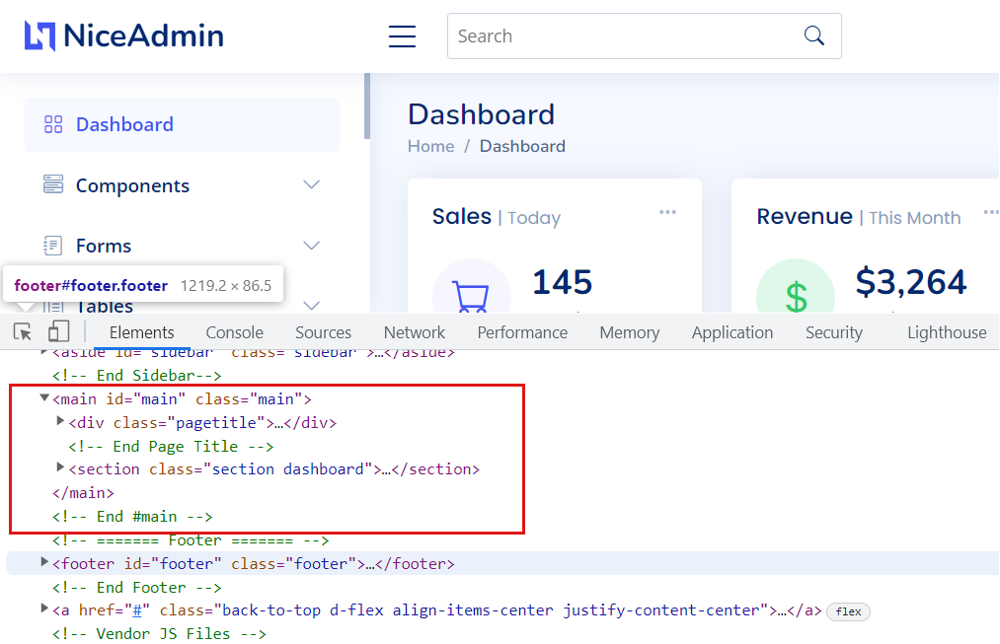

# Day 1 Tutorial
In day 1, we will learn:
- [How To Create Basic Angular App from Angular CLI](#how_to_create_basic_angular_app_from_angular_cli)
- [How to create component and implement Header and Footer](#how_to_create_component_and_implement_header_and_footer)
- [How to use bootstrap in Angular](#how_to_use_bootstrap_in_angular)
- [Import template css files in Angular](#import_template_css_files_in_angular)
- [Add Dashboard Page in Angular](#add_dashboard_page_in_angular)
- [Routing in Angular](#routing_in_angular)

## How To Create Basic Angular App from Angular CLI
To Create new Angular Project, Angular provides cli to create basic structure.  
Run following command:
```bash
ng new ng-tutorial --routing --strict --style scss
```
Above command will create a basic angular app. We used routing option, so Angular will create a AppRoutingModule for routing.
Now run the project with command:
```bash
npm start
```
Or
```bash
ng serve
```

## How to create component and implement Header and Footer
In this tutorial we are using free version of [Nice Admin Template](https://bootstrapmade.com/nice-admin-bootstrap-admin-html-template/). We will create a header and footer component via Angular Cli to port Header and footer of template.  
To create Header component. Run command:
```bash
ng g c core/header
```
We created Header component in core folder as we want all common and reusable components, services, modules etc. to reside in a single folder core. Now we will copy header HTML from downloaded template to [header.component.html](../src/app/core/components/header/header.component.html)
  
In same way, we will create footer component with command:
```bash
ng g c core/footer
```
Now we will copy footer HTML in [footer.component.html](../src/app/core/components/footer/footer.component.html).  

It's time to use newly created Header and Footer component in our project. Remove the existing demo html from [app.component.html](../src/app/app.component.html) and paste following content:
```html
<app-header></app-header>
<app-footer></app-footer>
```
Now visit [http://localhost:4200](http://localhost:4200). You will find your html will look weird. This is because we just imported html from template. Now we will import css.

## How to use bootstrap in Angular
Steps:
- Install via npm with following command:
    ```bash
    npm i bootstrap@latest
    ```
- Bootstrap supports modular structure. So you can include core scss and whatever components you need in [styles.scss](../src/styles.scss). Or you can include full bootstrap.scss. Copy paste below code in [styles.scss](../src/styles.scss):
    ```scss
    @import "/node_modules/bootstrap/scss/bootstrap.scss";
    ```  
    You can include bootstrap scss file in [angular.json](../angular.json) in architect > build > options > styles

## Import template css files in Angular
Steps:
- First we will copy google font url from index.html of template to [index.html](../src/index.html) of our app.
```html
  <link href="https://fonts.gstatic.com" rel="preconnect">
  <link href="https://fonts.googleapis.com/css?family=Open+Sans:300,300i,400,400i,600,600i,700,700i|Nunito:300,300i,400,400i,600,600i,700,700i|Poppins:300,300i,400,400i,500,500i,600,600i,700,700i" rel="stylesheet">
```
- Second we will copy style from download template's location `assets/css` to our app's location `src/assets/css`. After copy import copied [styles.css](../src/assets/css/style.css) in [styles.scss](../src/styles.scss).
    ```scss
    @import "./assets/css/style.css";
    ```
- This project using [bootstrap icons](https://icons.getbootstrap.com/). Instead of copying bootstrap icons from template, we will install it via npm.  
    steps:  
    1. Install via NPM  
        ```bash
        npm i bootstrap-icons
        ```
    2. Import in [styles.scss](../src/styles.scss):
        ```scss
        @import "/node_modules/bootstrap-icons/font/bootstrap-icons.css";
        ```
 - Now visit your browser again to see the changes. Now header and footer will look good.

## Add Dashboard Page in Angular
Steps:  
- Angular supports lazy loading of module. So we will create a module for Dashboard page with routing option via Angular CLI.
    ```bash
    ng g m pages/dashboard --routing
    ```
    We created dashboard page in **pages** folder so our folder structure will look more managed.  
- Now we will create a component for dashboard page via cli command.
    ```bash
    ng g c pages/dashboard/dashboard
    ```
    Now our folder structure will look something like this:  
      
- Now paste the html of Dashboard in [dashboard.component.html](../src/app/pages/dashboard/dashboard/dashboard.component.html). Refer below image:

- Now our Dashboard page is ready but How Angular will know when this newly created Dashboard page will render. To render Dashboard page, we will add routing in [AppRoutingModule](../src/app/app-routing.module.ts).
    ```typescript
    import { NgModule } from '@angular/core';
    import { RouterModule, Routes } from '@angular/router';

    const routes: Routes = [
    {
        path: "",
        loadChildren: () =>  import(/* webpackChunkName: "dashboard" */"./pages/dashboard/dashboard.module").then(m => m.DashboardModule)
    }
    ];

    @NgModule({
    imports: [RouterModule.forRoot(routes)],
    exports: [RouterModule]
    })
    export class AppRoutingModule { }
    ```

## Routing in Angular
Angular provides built in routing library @angular/router. To use routing in our app, first we need to modify [app.component.html](../src/app/app.component.html) and will add `<router-outlet></router-outlet>`. Angular renders routing component inside of `<router-outlet>`.  
So Let's add `router-outlet` in [app.component.html](../src/app/app.component.html) but before that we will add wrapper HTML form downloaded template. Refer below image:
  
So we will add main HTML tag with router-outlet. Now our [app.component.html](../src/app/app.component.html) will look like:
```html
<app-header></app-header>
<main class="main" id="main">
  <router-outlet></router-outlet>
</main>
<app-footer></app-footer>
```  
Now visit again your app in browser and you will find your Dashboard page will render Dashboard page.
