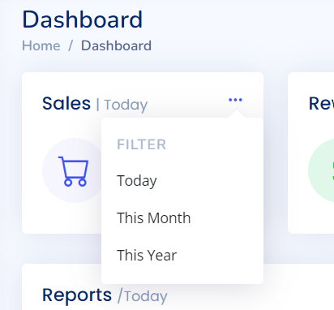

# Day 2 Tutorial
In Day 2, We will learn:
- [How to take external data in component](#How-to-take-external-data-in-component)
- [How to send data/notify outside from component](#How-to-send-data/notify-outside-from-component)

## How to take external data in component
In frontend, creation of component is very common. We can think of component as a reuseable UI with code.  
This reusable UI can be a component for card, input text or UI that used more than one time. Component eliminates duplicate code. The same we do in coding by creating a function.  
On Dashboard page, we seen 3 information card of same UI.  
    
  
  
We will create a component for information card. The easiest way to create a component is to create component from [Angular CLI](https://angular.io/cli/generate#component).

```bash
ng g c pages/dashboard/components/info-card
```  
This common UI have following placeholder:
- Title
- Applied Filter
- Icon
- Header
- Sub header
    - Percent
    - Increment or decrement

We will take above placeholder values from outside or we can whoever will use this component will provide above values.  
To take external data for component, we use `@Input()` decorator. Let's create above placeholder data as `Input` in [info component](../src/app/pages/dashboard/components/info-card/info-card.component.ts).  

```typescript
import { ChangeDetectionStrategy, Component, Input } from '@angular/core';

@Component({
  selector: 'app-info-card',
  templateUrl: './info-card.component.html',
  styleUrls: ['./info-card.component.scss'],
  changeDetection: ChangeDetectionStrategy.OnPush
})
export class InfoCardComponent {
  @Input()
  public title!: string;
  @Input()
  public iconUrl!: string;
  @Input()
  public iconClass!: string;
  @Input()
  public header!: string;
  @Input()
  public subHeader!: {
    percent: number;
    isIncrease: boolean;
  };

  public filter: string = DateFilter.today;

}

export enum DateFilter {
  today = "Today",
  month = "This Month",
  year =  "This Year"
}

```  
Now we can use these `Input decorators` in our [component html](../src/app/pages/dashboard/components/info-card/info-card.component.html) like this:
```html
<div class="card info-card sales-card">
    <div class="filter">
       <a class="icon" href="#" data-bs-toggle="dropdown"><i class="bi bi-three-dots"></i></a>
       <ul class="dropdown-menu dropdown-menu-end dropdown-menu-arrow">
          <li class="dropdown-header text-start">
             <h6>Filter</h6>
          </li>
          <li><a class="dropdown-item" href="#">Today</a></li>
          <li><a class="dropdown-item" href="#">This Month</a></li>
          <li><a class="dropdown-item" href="#">This Year</a></li>
       </ul>
    </div>
    <div class="card-body">
       <h5 class="card-title">{{ title}} <span>| {{ filter }}</span></h5>
       <div class="d-flex align-items-center">
          <div class="card-icon rounded-circle d-flex align-items-center justify-content-center">
            <i class="{{iconClass}}" *ngIf="iconClass; else elseIconUrl"></i>
            <ng-template #elseIconUrl>
                
            </ng-template>
          </div>
          <div class="ps-3">
             <h6>{{ header}}</h6>
             <span class="text-success small pt-1 fw-bold">{{ subHeader.percent}}%</span>
             <span class="text-muted small pt-2 ps-1">{{subHeader.isIncrease ? "increase" : "decrease"}}</span>
          </div>
       </div>
    </div>
 </div>
```  
We copied info card HTML from [Dashboard HTML](../src/app/pages/dashboard/dashboard/dashboard.component.html) and pasted into info card html.  
You can notice we used `{{}}` syntax. This syntax `{{}}` is known template literal. This is used to render value of component's class properties in HTML.

## How to send data/notify outside from component
To demonstrate this, let's create another component for filter dropdown menu shown in below picture.  
  
As this UI is common, so we will create this component in core folder.  
```bash
ng g c core/components/dropdown-menu 
```  
This dropdown menu UI have two placeholders:
- Title/Header (Filter)
- Menu Items (Today, This Month, This Year). In real world key and text to be shown can be different. So here we will take key and text both  
We learned in section [How to take external data in component](#How-to-take-external-data-in-component) that placeholder means create `@Input()` decorators. So we will create two input decorators in [dropdown menu component](../src/app/core/components/dropdown-menu/dropdown-menu.component.ts).  

```typescript
import { ChangeDetectionStrategy, Component, Input } from '@angular/core';
import { Dropdown } from 'bootstrap';

@Component({
  selector: 'app-dropdown-menu',
  templateUrl: './dropdown-menu.component.html',
  styleUrls: ['./dropdown-menu.component.scss'],
  changeDetection: ChangeDetectionStrategy.OnPush
})
export class DropdownMenuComponent {
  @Input()
  public title!: string;

  @Input()
  public dropdownItems: DropdownItem[] = [];

  public onDropdownItemClick() {

  }
}

export interface DropdownItem {
  key: string;
  value: string;
}
```  
In [component's HTML](../src/app/core/components/dropdown-menu/dropdown-menu.component.html):
```html
<ng-content></ng-content>
<ul class="dropdown-menu dropdown-menu-end dropdown-menu-arrow">
    <li class="dropdown-header text-start">
       <h6>Filter</h6>
    </li>
    <li><a class="dropdown-item" href="#">Today</a></li>
    <li><a class="dropdown-item" href="#">This Month</a></li>
    <li><a class="dropdown-item" href="#">This Year</a></li>
 </ul>
```  
We used `ng-content`as we want to take HTML where user will click to show/hide dropdown menu.  
Now we have in situation where dropdownItems will be multiple. In this case, we will use [ngFor](https://angular.io/api/common/NgFor). Now component HTML will look like:
```html
<ng-content></ng-content>
<ul class="dropdown-menu dropdown-menu-end dropdown-menu-arrow">
    <li class="dropdown-header text-start">
       <h6>{{ title }}</h6>
    </li>
    <li *ngFor="let item of dropdownItems">
        <a class="dropdown-item" href="#">{{item}}</a>
    </li>
</ul>
```  
When user will click on dropdown item then we will inform to parent component with clicked dropdown item. To implement this, we will register a click event on click of dropdown item and will pass clicked dropdown item to component ts like this:
```html
<ng-content></ng-content>
<ul class="dropdown-menu dropdown-menu-end dropdown-menu-arrow">
    <li class="dropdown-header text-start">
       <h6>{{ title }}</h6>
    </li>
    <li *ngFor="let item of dropdownItems">
        <a class="dropdown-item" href="#" (click)="onDropdownItemClick(item)">{{item.key}}</a>
    </li>
</ul>
```  
Now it's time to receive data from component's html to component's ts. We will create a method `onDropdownItemClick` with a parameter item.
```typescript
import { ChangeDetectionStrategy, Component, Input } from '@angular/core';
import { Dropdown } from 'bootstrap';

@Component({
  selector: 'app-dropdown-menu',
  templateUrl: './dropdown-menu.component.html',
  styleUrls: ['./dropdown-menu.component.scss'],
  changeDetection: ChangeDetectionStrategy.OnPush
})
export class DropdownMenuComponent {
  @Input()
  public title!: string;

  @Input()
  public dropdownItems: DropdownItem[] = [];

  public onDropdownItemClick(dropdownItem: DropdownItem) {

  }
}

export interface DropdownItem {
  key: string;
  value: string;
}
```
Now we will send this clicked dropdown item to outside of component. To do this, we will use `@Output()` decorator with `EventEmitter`.  
```typescript
import { ChangeDetectionStrategy, Component, EventEmitter, Input, Output } from '@angular/core';
import { Dropdown } from 'bootstrap';

@Component({
  selector: 'app-dropdown-menu',
  templateUrl: './dropdown-menu.component.html',
  styleUrls: ['./dropdown-menu.component.scss'],
  changeDetection: ChangeDetectionStrategy.OnPush
})
export class DropdownMenuComponent {
  @Input()
  public title!: string;

  @Input()
  public dropdownItems: DropdownItem[] = [];

  @Output()
  public dropdownItemClick = new EventEmitter<DropdownItem>();

  public onDropdownItemClick(dropdownItem: DropdownItem) {
    this.dropdownItemClick.emit(dropdownItem);
  }
}

export interface DropdownItem {
  key: string;
  value: string;
}
```  
Let's use this DropdownMenuComponent in [info component](../src/app/pages/dashboard/components/info-card/info-card.component.html).
```html
<div class="card info-card sales-card">
    <div class="filter">
       <app-dropdown-menu title="Filter" [dropdownItems]="filterData">
         <a class="icon" href="#" data-bs-toggle="dropdown"><i class="bi bi-three-dots"></i></a>
       </app-dropdown-menu>
    </div>
    <div class="card-body">
       <h5 class="card-title">{{ title}} <span>| {{ filter }}</span></h5>
       <div class="d-flex align-items-center">
          <div class="card-icon rounded-circle d-flex align-items-center justify-content-center">
            <i class="{{iconClass}}" *ngIf="iconClass; else elseIconUrl"></i>
            <ng-template #elseIconUrl>
                
            </ng-template>
          </div>
          <div class="ps-3">
             <h6>{{ header}}</h6>
             <span class="text-success small pt-1 fw-bold">{{ subHeader.percent}}%</span> <span class="text-muted small pt-2 ps-1">{{subHeader.isIncrease ? "increase" : "decrease"}}</span>
          </div>
       </div>
    </div>
</div>
```  
In above HTML, we used `<a class="icon" href="#" data-bs-toggle="dropdown"><i class="bi bi-three-dots"></i></a>` inside `app-dropdown-menu`. `ng-content` will render HTMl inside of `app-dropdown-menu`. This concept is known as [content projection in Angular](https://angular.io/guide/content-projection).  
Now it's time to take selected dropdown item in [info component](../src/app/pages/dashboard/components/info-card/info-card.component.ts).  
[info-card.component.html](../src/app/pages/dashboard/components/info-card/info-card.component.html)
```html
<app-dropdown-menu title="Filter" [dropdownItems]="filterData" (dropdownItemClick)="onDropdownItemClick($event)">
    <a class="icon" href="#" data-bs-toggle="dropdown"><i class="bi bi-three-dots"></i></a>
</app-dropdown-menu>
```  
[info-card.component.ts](../src/app/pages/dashboard/components/info-card/info-card.component.ts)
```typescript
import { ChangeDetectionStrategy, Component, Input } from '@angular/core';
import { DropdownItem } from 'src/app/core/components/dropdown-menu/dropdown-menu.component';

@Component({
  selector: 'app-info-card',
  templateUrl: './info-card.component.html',
  styleUrls: ['./info-card.component.scss'],
  changeDetection: ChangeDetectionStrategy.OnPush
})
export class InfoCardComponent {
  @Input()
  public title!: string;
  @Input()
  public iconUrl!: string;
  @Input()
  public iconClass!: string;
  @Input()
  public header!: string;
  @Input()
  public subHeader!: {
    percent: number;
    isIncrease: boolean;
  };

  public filter: string = DateFilter.today;
  public filterData: DropdownItem[] = [
    { key: DateFilter.today, value: DateFilter.today },
    { key: DateFilter.month, value: DateFilter.month },
    { key: DateFilter.year, value: DateFilter.year }
  ];

  public onDropdownItemClick(item: DropdownItem) {
    console.log("Selected Filter!!", item);
  }

}

export enum DateFilter {
  today = "Today",
  month = "This Month",
  year =  "This Year"
}
```
